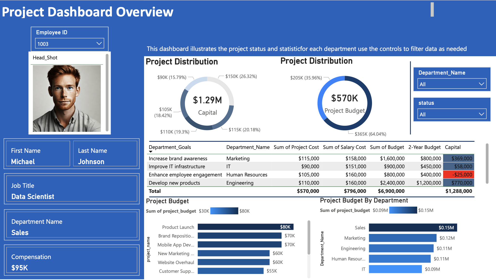

# 📊 Project Management Dashboard - README

## 📁 Overview

This project is a data-driven dashboard designed to monitor and analyze project and employee performance across different departments using a SQL Server database and Power BI.

## 📑 Task Brief

**Subject: Request for Data Analysis & Power BI Dashboard Development**

Dear Data Analyst,

Your expertise is needed to organize data and develop a dashboard to help us:

* Manage workforce
* Understand financial risks
* Monitor project health effectively

### 🔍 Key Question to Address:

**"Which projects and departments are at risk of being over budget or underperforming?"**

> *(Note: Department budgets are set at 2-year intervals; assess if annual budgets can cover expenses.)*

### ✍️ Tasks:

* **Identify Risks**: Flag over-budget departments or underperforming projects for corrective action.
* **Data Organization**: Structure data (employee info, salaries, budgets, project details) for reporting.
* **Dashboard Development**: Collaborate to build a Power BI dashboard tracking:

  1. Employee performance
  2. Salary distribution
  3. Departmental project management

Best regards,
Manager

## 🧱 Database Structure

The SQL Server database named **`project`** includes the following main tables:

| Table Name                | Description                                                          |
| ------------------------- | -------------------------------------------------------------------- |
| `dbo.completed_projects`  | Stores details of finished projects including budget and outcomes.   |
| `dbo.upcoming_projects`   | Contains future/planned project details.                             |
| `dbo.projects`            | Centralized list of all projects.                                    |
| `dbo.project_assignments` | Tracks which employees are assigned to which projects.               |
| `dbo.employees`           | Employee details like name, job title, department, and compensation. |
| `dbo.departments`         | Department information including goals and budgets.                  |

## 📈 Dashboard Insights

The Power BI dashboard utilizes data from the SQL Server to provide:

* **Project Budget Distribution**: Visualizes total budget per project and per department.
* **Department Goals Overview**: Tracks key financials like salary costs, capital, and 2-year budgets.
* **Employee Allocation**: Shows assignments and distribution of human resources across projects.
* **Capital Management**: Assesses departmental capital utilization and gaps.
* **Risk Identification**: Highlights departments and projects at risk of over-expenditure or underperformance.

## ⚙️ Data Import

Data was imported into Power BI using a custom SQL query (see `Query used to import data in power bi.sql`). This query pulls comprehensive project and employee data for visualization.

## 🧪 Sample Insight

Example from dashboard:

* **Marketing** department has the goal to “Increase brand awareness” with a **2-Year Budget** of \$800,000 and **Capital** of \$369,000.
* **Engineering** handles high-investment projects with a **Budget** of \$1.2M and **Capital** of \$770,000.

## 📌 How to Use

1. Set up the SQL Server and import data into the respective tables as per the schema (`tables Schema.png`).
2. Open Power BI and connect to the SQL Server database.
3. Load data using the provided SQL query.
4. Explore visual insights via filters (e.g., department, project status).

## 👨‍💻 Developer Info

**Michael Johnson**
Job Title: Data Scientist
Department: Sales
Compensation: \$95K
